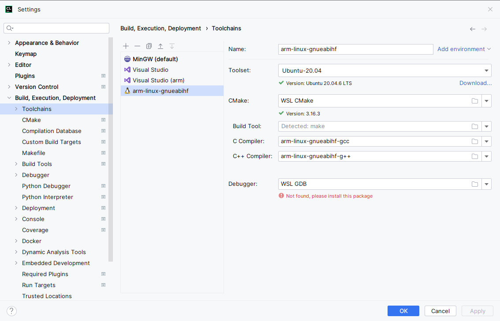
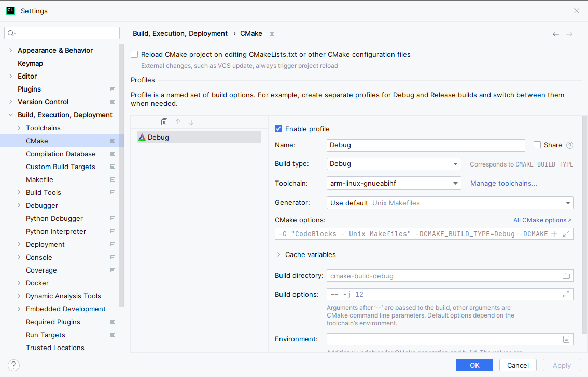
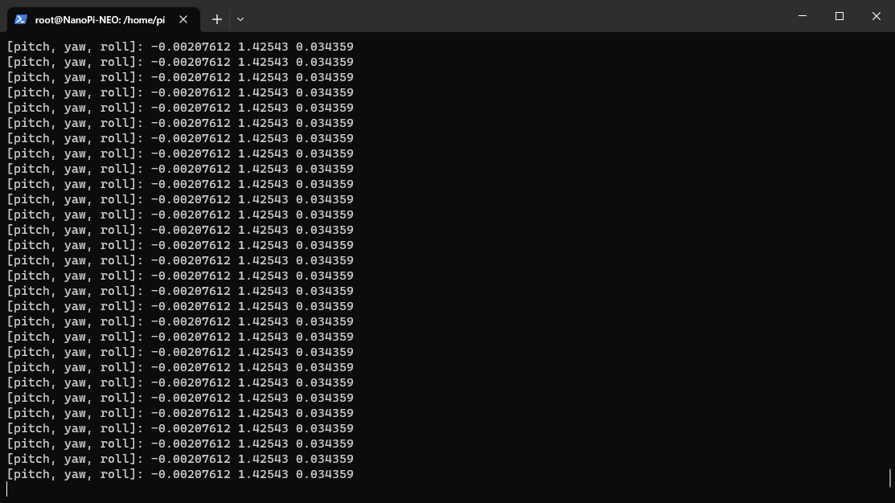
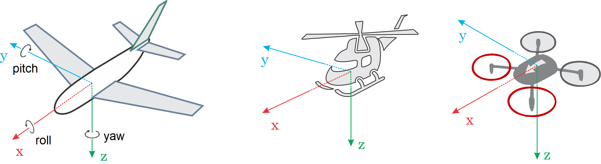
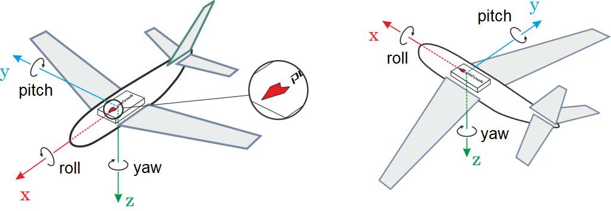

# Drone MavLink Transport

## Installing the toolchain on the WSL

The project can be built using various toolsets, but the easiest is to use WSL. But before you can use a linux
subsystem, you must install a toolchain on it:
```bash
sudo apt update
sudo apt install gcc-arm-linux-gnueabihf g++-arm-linux-gnueabihf -y
```

## Configure Toolchains and CMake

To configure the tolchains, you must add a new one by clicking the plus button. The name can be arbitrary,
but the following values must be specified for the compiler:

* **C Compiler** - arm-linux-gnueabihf-gcc
* **C++ Compiler** - arm-linux-gnueabihf-g++



In the CMake settings, specify the build type and select the toolchain you created earlier.



## Copy to NanoPI

After generating and building the project, it is necessary to copy the executable file to the remote machine (NanoPI).
This can be done with the following command:
```bash
scp DroneMavLinkTransport root@192.168.1.111:/home/pi
scp libMavLinkCom.so root@192.168.1.111:/home/pi
```

## How to Use

First, you need to start the application. This can be done by running the following command:
```bash
./DroneMavLinkTransport
```

After that the program will display the current state of the flight controller (compass data). If you change the inclination of the controller, the data in the terminal will also change.



## Calculating Orientation

ROLL, PITCH and/or YAW offsets of the flight controller are calculated relative to the vehicle around the forward (x), right (y), down (z) axes [2].



The axes to rotate around stay the same from one rotation step to the next one. So the frame to perform the rotation in stays fixed. This is also known as extrinsic rotation. 



## Extra Links 

1. https://www.jetbrains.com/help/clion/remote-debug.html#debug-shared-libs
2. https://docs.px4.io/main/en/config/flight_controller_orientation.html